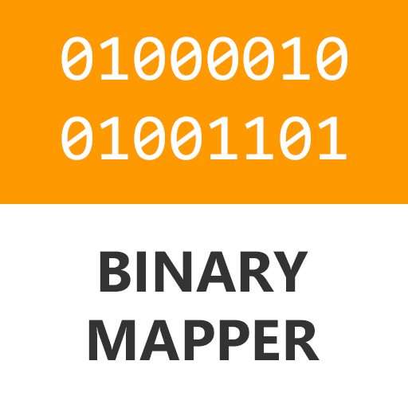

# Binary Mapper

[](https://ci.appveyor.com/project/alanedwardes/binarymapper)


BinaryMapper is a simple cross-platform library to parse binary files into their respective data structures in C#. It uses reflection to understand structures, and reads the data into the structure from a seekable stream.

Currently the library supports reading Minidumps and executables based on the structures published on MSDN. Spporting other file formats is a case of definining the structures and pointing the library at them.

## BinaryMapper.Core [](https://www.nuget.org/packages/BinaryMapper.Core/)
This example shows how to load a binary stream into structures you have defined.
```csharp
public class MYFILE_HEADER_STRUCT
{
    public uint Signature;
    public uint Version;
    public uint SomeOffset;
    public uint NumberOfEntries;
    [ArraySize(nameof(NumberOfEntries))]
    public MYFILE_STREAM_STRUCT[] MyStructures;
}

public class MYFILE_STREAM_STRUCT
{
    public uint Flags;
}

var stream = File.OpenRead("myfile.bin");
var streamBinaryMapper = new StreamBinaryMapper();
var header = streamBinaryMapper.ReadObject<MYFILE_HEADER_STRUCT>(stream);
```

## BinaryMapper.Windows.Minidump [](https://www.nuget.org/packages/BinaryMapper.Windows.Minidump/)
This example shows how to extract the names of the loaded modules from a memory dump stream.
```csharp
var stream = File.OpenRead("minidump.dmp");
var minidumpMapper = new MinidumpMapper();
var minidump = minidumpMapper.ReadMinidump(stream);

Console.WriteLine($"This minidump is of type {minidump.Header.Flags}");
foreach (var module in minidump.Modules)
{
    Console.WriteLine(module.Key);
}
```

## BinaryMapper.Windows.Executable [](https://www.nuget.org/packages/BinaryMapper.Windows.Executable/)
This example shows how to load an executable, find out whether it is 32 or 64 bit, and which version of Windows it targets.
```csharp
var stream = File.OpenRead("executable.exe");
var executableMapper = new ExecutableMapper();
var executable = executableMapper.ReadExecutable(stream);

if (executable.OptionalHeader != null)
{
    Console.WriteLine($"32-bit executable for Windows {executable.OptionalHeader.OperatingSystemVersion}");
}
else
{
    Console.WriteLine($"64-bit executable for Windows {executable.OptionalHeader64.OperatingSystemVersion}");
}
```


## Getting Started

### Download Microsoft development tools

If you working on Windows, download Visual Studio 2019 Community Edition to get started.  This version is free for personal use.
* [Download Visual Studio 2019 Community Edition](https://visualstudio.microsoft.com/thank-you-downloading-visual-studio/?sku=Community)

To get started on Mac and Linux, you can download .NET Core 3.0.  
* [Download .NET Core 3.0](https://dotnet.microsoft.com/download/dotnet-core/3.0)


### Download
* [Github](https://github.com/alanedwardes/BinaryMapper)
* [BinaryMapper.Core on Nuget](https://www.nuget.org/packages/BinaryMapper.Core/)
* [BinaryMapper.Windows.Minidump on Nuget](https://www.nuget.org/packages/BinaryMapper.Windows.Minidump/)
* [BinaryMapper.Windows.Executable on Nuget](https://www.nuget.org/packages/BinaryMapper.Windows.Executable/)

## Documentation
The documentation can be found at [https://alanedwardes.github.io/BinaryMapper](https://lanedwardes.github.io/BinaryMapper)


## Contributing
View the [Binary Mapper GitHub Project](https://github.com/alanedwardes/BinaryMapper)
for information on contributing.

